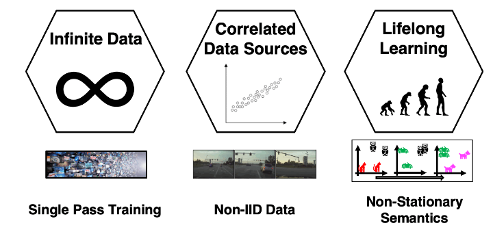

# Continuous Self-Supervised Learning

Official repo, containing code and pretrained models, for our ECCV 2022 paper:

[The Challenges of Continuous Self-Supervised Learning](https://arxiv.org/abs/2203.12710) \
[Senthil Purushwalkam](https://www.senthilpurushwalkam.com/) \*, 
[Pedro Morgado](https://pedro-morgado.github.io/) \* and  [Abhinav Gupta](http://www.cs.cmu.edu/~abhinavg/)



## Requirements

To set up your own conda environment for this project, follow this script.
```bash
conda create -n contssl && conda activate contssl
conda install -y pytorch=1.12.0 torchvision=0.13.0 torchaudio=0.12.0 cudatoolkit=10.2 -c pytorch
pip install submitit hydra-core
conda install -y tensorboard=2.9.1 -c conda-forge
git clone https://github.com/NVIDIA/apex && cd apex && pip install -v --disable-pip-version-check --no-cache-dir ./
```


## Training on Continuous Streams of Data 
This repository provides code for training models presented in the paper.
Our implementation is based on [SimSiam](https://github.com/facebookresearch/simsiam) with modifications for creating and sampling Efficient Buffers for producing training mini-batches (see [here](datasets/mysampler.py)).


### ResNet-18 on Flickr-20M (Section 4)
```bash
export arch="model/backbone=resnet18" # Option: resnet50
# Epoch-based SSL (Conventional 10 epochs)
export FLAGS='logging.name=r18_flickr20M_epochs10 optim.epochs=10'

# Single-pass SSL (Conventional)
export FLAGS='logging.name=r18_flickr20M_singlepass optim.epochs=1'

# Single-pass SSL (Buffer x 10 updates)
export FLAGS='logging.name=r18_flickr20M_buff model=bstream model.buff_siz=65536 model.num_updates=10 optim.epochs=1'

PYTHONPATH=. python main.py data=flickr20M optim.lr=0.05 environment.data_dir=<logs_folder> data.base_dir=<flickr_folder> environment.ngpu=4 environment.workers=40  lincls.imnet.eval_params.resume_epoch=\${optim.epochs} ${arch} ${FLAGS}
```

|               | Single Pass | Backbone | Buffer Size | ImageNet Acc | iNat Acc | ckp                                                                                        |
|---------------|:-----------:|:--------:|:-----------:|:------------:|:--------:|--------------------------------------------------------------------------------------------|
| Conventional  |     [ ]     |   R18    |      -      |    41.672    |  17.330  | [link](https://drive.google.com/file/d/12724YbqplS2BjaP6vzM70MPVTJLMH7UT/view?usp=sharing) |
| Conventional  |     [x]     |   R18    |      -      |    32.216    |  12.253  | [link](https://drive.google.com/file/d/1Dv-tGTQATffWJfoXrsvMz4kR2x117MTP/view?usp=sharing) |
| FIFO Buffer   |     [x]     |   R18    |     64K     |    41.760    |  17.404  | [link](https://drive.google.com/file/d/1su2KdeVEmFEz4Ve6SZFrsu3235HUwYUV/view?usp=sharing) |


### ResNet-18 on Kinetics-400 8 FPS (Section 5)
```bash
export arch="model/backbone=resnet18" # Option: resnet50
# Epoch-based SSL w/ Decorrelated sources (Conventional 5 epochs)
export FLAGS='logging.name=r18_kinetics64_decorr_epochs5 model.buffer_type="none_noseq" optim.epochs=5'

# Epoch-based SSL (Conventional 5 epochs)
export FLAGS='logging.name=r18_kinetics64_epochs5 data.seq_sampling="random" optim.epochs=5'

# Single-pass SSL (Buffer x 5 updates)
export FLAGS='logging.name=r18_kinetics64_buff64k_updates5 data.seq_sampling="random" model=bstream model.buff_siz=65536  model.num_updates=5  optim.epochs=1'

# Single-pass SSL (MinRed Buffer x 5 updates)
export FLAGS='logging.name=r18_kinetics64_minredbuff64k_updates5 data.seq_sampling="random" model=bstream model.buffer_type="minred" model.buff_siz=65536  model.num_updates=5  optim.epochs=1'

PYTHONPATH=. python main.py data=kinetics optim.epochs=5 optim.lr=0.05 environment.data_dir=<logs_folder> environment.ngpu=4 environment.workers=40 lincls.imnet.eval_params.resume_epoch=\${optim.epochs} ${arch} ${FLAGS}
```
|                     | Single Pass | Sequential | Buffer Size | ImageNet Acc | iNat Acc | ckp                                                                                        |
|---------------------|:-----------:|:----------:|:-----------:|:------------:|:--------:|--------------------------------------------------------------------------------------------|
| Decorrelated Source |     [ ]     |    [ ]     |     --      |    31.399    |  10.657  | [link](https://drive.google.com/file/d/1wKquTvlOI0zO150cI0JAtFueC6GR8x63/view?usp=sharing) |
| Conventional        |     [ ]     |    [ ]     |     --      |    8.092     |  0.791   | [link](https://drive.google.com/file/d/1tzeDIdGUwaLqaSuhf03bf8q0_CMC8Vjc/view?usp=sharing) |
| FIFO Buffer         |     [x]     |    [ ]     |     64K     |    9.840     |  0.770   | [link](https://drive.google.com/file/d/1AS0PJuoir2xeH0V6L0x265H4j9BGVTdB/view?usp=sharing) |
| MinRed Buffer       |     [x]     |    [ ]     |     64K     |    30.612    |  9.612   | [link](https://drive.google.com/file/d/1wD8-lIy3CWsxNrs63jDsDL4Egh4aUpdG/view?usp=sharing) |

### ResNet-18 on Continual Full ImageNet (Section 6)

First download the Full ImageNet dataset (`<fullimnet_folder>`).
For running the continual learning experiments, we need to use four splits of the Full Imagenet dataset and pass them sequentially to the model. These splits are provided here. Download them to any location (`<fullimnet_splits_folder>`). Download the checkpoint for Simsiam model trained on Flickr200M above (`<simsiam_flickr200m_ckpt>`).

```bash
# Choose a split order 
export order='0123' #Options: 0123, 0312, 3120
export arch="model/backbone=resnet18" # Option: resnet50

# Single Pass (Conventional)
export FLAGS='logging.name=r18pt_in21kcont_${order} data.train_filelist=<fullimnet_splits_folder>/filelist_${order}.memmap'

# Single Pass (Buffer - 4 Updates with 1/4 data)
export FLAGS='logging.name=r18pt_in21kcont_f4_buff64k_upd4_${order data=memmap_sequential data.train_filelist=<fullimnet_splits_folder>/filelist_${order}_f4.memmap data.num_files=3189346 model=bstream model.num_updates=4 model.buff_siz=65536' 

# Single Pass (MinRed Buffer - 4 Updates with 1/4 data)
export FLAGS='logging.name=r18pt_in21kcont_f4_minredbuff64k_upd4_${order} data.train_filelist=<fullimnet_splits_folder>/filelist_${order}_f4.memmap data.num_files=3189346 model=bstream model.num_updates=4 model.buff_siz=65536 model.buffer_type=minred'

PYTHONPATH=. python main.py data=memmap_sequential optim.lr_schedule.type=constant optim.lr=0.01 optim.epochs=1 data.base_dir=<fullimnet_folder> environment.data_dir=<logs_folder> environment.ngpu=4 environment.workers=40 logging.save_freq=0.05 model.sync_bn=True  model.pretrained=<simsiam_flickr200m_ckpt> ${arch} ${FLAGS}
```
|                                   | Single Pass | Buffer Size |  Acc (@ 25-50-75-100% Prog)   |  Forgetting % (D0)  | Forgetting % (D1) | Forgetting % (D2) | ckp                                                                                                                                                                                                                                                                                |
|-----------------------------------|:-----------:|:-----------:|:-----------------------------:|:-------------------:|:-----------------:|:-----------------:|------------------------------------------------------------------------------------------------------------------------------------------------------------------------------------------------------------------------------------------------------------------------------------|
| Conventional                      |     [x]     |     --      | 11.21 - 11.58 - 11.74 - 11.85 | 4.87 - 3.83 - 4.84  |    5.54 - 7.31    |       5.14        | [0123](https://drive.google.com/file/d/1iieU6_0B4Z9SE39czjF2P7U2vSqY5HOO/view?usp=sharing), [0312](https://drive.google.com/file/d/12QOoZs_QzrV_bSXvCCxJPbjtHzt9w4we/view?usp=sharing), [3120](https://drive.google.com/file/d/1dSYVNWJdIaH5BmNY-k4DLvRqxx5zEcLL/view?usp=sharing) |
| FIFO Buffer (4 Upd on 1/4 data)   |     [x]     |     64K     | 11.16 - 11.44 - 11.61 - 11.70 | 4.80 - 4.18 - 5.51  |    5.48 - 6.27    |       4.10        | [0123](https://drive.google.com/file/d/1kjsSAVWyxlGJCMYxti2e-UMacbno_Vm2/view?usp=sharing), [0312](https://drive.google.com/file/d/1X2ZviySghpoh8AR0U7OnCWTrncDarKdR/view?usp=sharing), [3120](https://drive.google.com/file/d/1QcP6tF3W6mdoFWKYLQ0mdZh1Z82tdvgZ/view?usp=sharing) |
| MinRed Buffer (4 Upd on 1/4 data) |     [x]     |     64K     | 11.41 - 11.75 - 11.91 - 11.93 | 1.93 - 2.86 - 4.28  |    1.99 - 2.86    |       1.92        | [0123](https://drive.google.com/file/d/1M4YYNpj61InAq4xVF2CTMMhzdMcpzHSm/view?usp=sharing), [0312](https://drive.google.com/file/d/1M4YYNpj61InAq4xVF2CTMMhzdMcpzHSm/view?usp=sharing), [3120](https://drive.google.com/file/d/1K-0bWRHasRI6XIEXir0YZztTG8AAGC-z/view?usp=sharing) |


### ResNet-50 on Flickr-20M
|               | Single Pass | Backbone | Buffer Size | ImageNet Acc | iNat Acc | ckp                                                                                        |
|---------------|:-----------:|:--------:|:-----------:|:------------:|:--------:|--------------------------------------------------------------------------------------------|
| Conventional  |     [ ]     |   R50    |      -      |    57.034    |  29.076  | [link](https://drive.google.com/file/d/1cygYM-H1N99sy4MZAo91XJ0riCKpoNcR/view?usp=sharing) |
| Conventional  |     [x]     |   R50    |      -      |    18.306    |  2.395   | [link](https://drive.google.com/file/d/1NqTDgh41iQIgVDpY1j9D6hbFhQpmdyMg/view?usp=sharing) |
| FIFO Buffer   |     [x]     |   R50    |     64K     |    57.062    |  28.187  | [link](https://drive.google.com/file/d/1ill9aLZL0xtazoUmu3mNXAXiXjXrLJZ8/view?usp=sharing) |


### ResNet-50 on Kinetics-400 (8 FPS)
|                     | Single Pass | Buffer Size | ImageNet Acc | iNat Acc | ckp                                                                                        |
|---------------------|:-----------:|:-----------:|:------------:|:--------:|--------------------------------------------------------------------------------------------|
| Decorrelated Source |     [ ]     |             |    43.340    |  17.264  | [link](https://drive.google.com/file/d/1hiOrX92gvf6D9a4RTetOQ63wHUo0iHEV/view?usp=sharing) |
| Conventional        |     [ ]     |             |    15.502    |  3.079   | [link](https://drive.google.com/file/d/1EBtWJY4j7mD7HnBpGByTlYfA6rfsrkq1/view?usp=sharing) |
| Conventional        |     [x]     |             |    11.924    |  1.228   | [link](https://drive.google.com/file/d/1AChu4-q2dyBPgNVvXXLYAViBPxrS1RUT/view?usp=sharing) |
| FIFO Buffer         |     [x]     |     64K     |    7.150     |  0.348   | [link](https://drive.google.com/file/d/1TV8sbcH_6eJAyKUxvMrLDm5HaYyKYp8A/view?usp=sharing) |
| MinRed Buffer       |     [x]     |     64K     |    40.584    |  15.636  | [link](https://drive.google.com/file/d/1rj4xa1HpgQwcYTR06Gcm_AO0_SlFVx26/view?usp=sharing) |


## Cite
If you find this work useful in your research, please cite:
```
@article{purushwalkam2022challenges,
  title={The Challenges of Continuous Self-Supervised Learning},
  author={Purushwalkam, Senthil and Morgado, Pedro and Gupta, Abhinav},
  journal={arXiv preprint arXiv:2203.12710},
  year={2022}
} 
```
